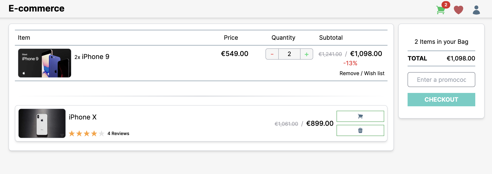
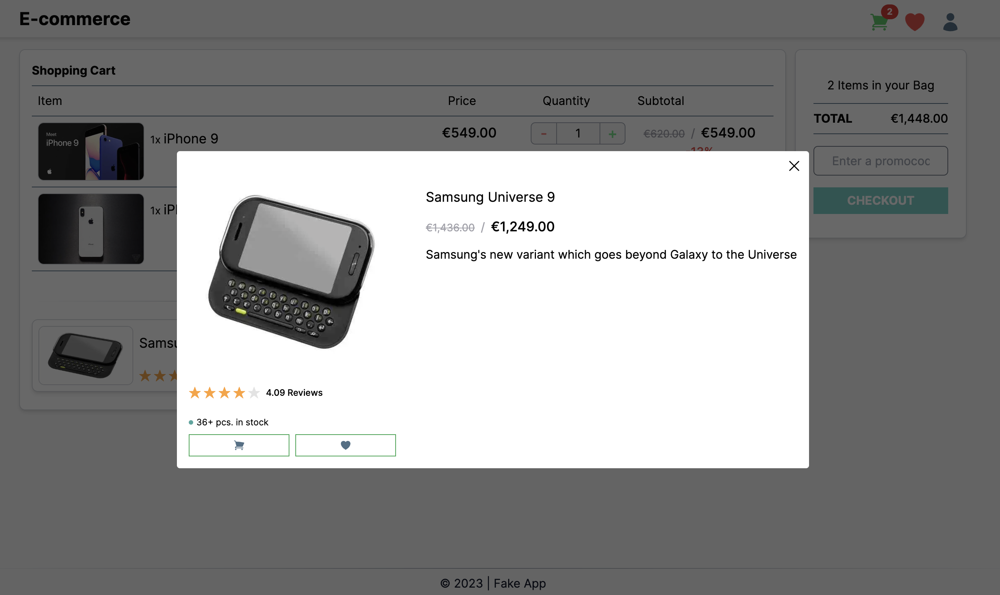
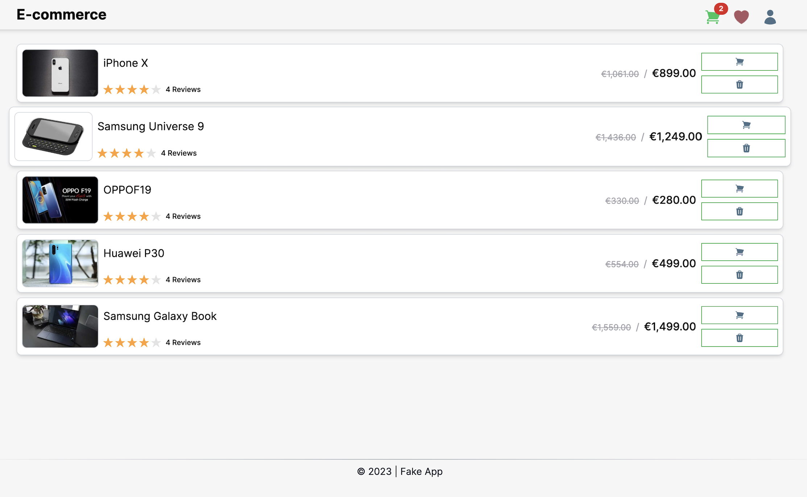
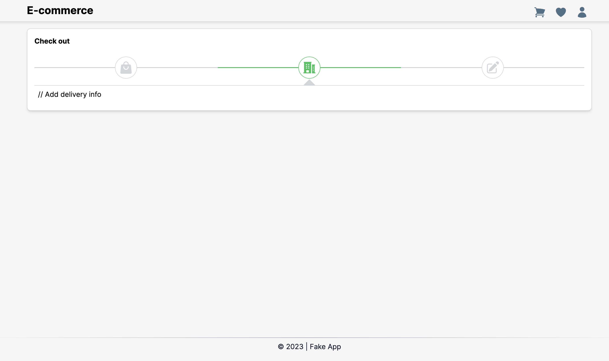

# Motivation

There are two reasons why this repo exists.

1. My main mission behind this repo is to show you my ability to work with this
   stack of technologies and how I organize the project and code as well.

2. Just challenging myself with the latest version (during development) of
   NextJs (v14+) and React-toolkit

**I haven't used any AI tools like ChatGPT, CoPIlot, or any other "crutches" for
the mind.**

## Basic preview of the functionality







## Requirements

- [Node](https://nodejs.org/en/) `^18.17.0`
- [NPM](https://www.npmjs.com/) `^9.6.7`

## Installation

After confirming that your environment meets the
above [requirements](#requirements), it is time to clone the projects
locally by doing the following:

**Cloning the FE App:**

```bash
$ git clone git@github.com:DeanHristov/fake-e-commerce-web-app.git <project-name>
$ cd <project-name>
```

When you're done with the steps above, run the following command:

```bash
$ npm install # or yarn install
```

---

**Cloning the** [Fake API](https://github.com/DeanHristov/fake-api-e-commerce)

```bash
$ git clone https://github.com/DeanHristov/fake-api-e-commerce.git <project-name>
$ cd <project-name>
```

When you're done with the steps above, run the following command:

```bash
$ npm install # or yarn install
```

## Configuration

Create a **.env** file in a root folder and copy-paste variables below

```dotenv
# Not used at this stage!
API_MOCKING=false

# This variable must match the running URL on the Fake API!
# See: https://github.com/DeanHristov/fake-api-e-commerce?tab=readme-ov-file#running-the-project
API_URL=http://localhost:3002/api/v1

BASE_URL=http://localhost:3000/api

JWT_SECRET=super-secret-word
JWT_EXPIRE=10m
```

## Running the Project

Before starting the app you must first start the Fake API by following the steps [here](https://github.com/DeanHristov/fake-api-e-commerce#running-the-project)!

Running the app in **development** mode

```bash
$ npm run dev
```

Running the app in **production** mode. Firstly, build the app with the
following command:

```bash
$ npm run build
```

then start the app

```bash
$ npm start
```

## Included functionality

- Currently, the app supports the following pages:

  - A home page
  - A shopping cart page
  - A wish list page
  - A login page
  - A checkout page
  - An admin page (portal) - **Coming soon**
  - A custom shopping cart page (per userId) - **Coming soon**
  - A custom wish list page (per userId) - **Coming soon**

- The visitor (not signed user) can do following:
  - See a list of products
  - Adding a product to the basket
  - Removing a product from the basket
  - Adding a product to the wish list
  - Removing a product from the wish list
  - See details (through the modal box) of any product
  - Do a checkout process (fake!)
  - Keeping basket & wish list in persistent store (localStorage)
  - Pagination - **Coming soon**
- Authentication - **Coming soon**
  - A JWT and cookie which expires in 10 minutes
  - User can login with email and password
  - User can logout
- When the user is signed In:
  - See a list of products
  - Adding a product to the basket
  - Removing a product from the basket
  - Adding a product to the wish list
  - Removing a product from the wish list
  - See details (through the modal box) of any product
  - Do a checkout process (fake!)
  - Do voting - **Coming soon**
  - Be able to fetch, see and manage its basket in a separate route - **Coming soon**
  - Be able to fetch, see and manage its wish list in a separate route - **Coming soon**
  - Be able to manage its personal information like password, name, email etc... - **Coming soon**
  - See a history with its orders
- When the admin is signed In: - **Coming soon**
  - Has access to the admin panel
  - Can perform all CRUD operations over the users
  - Can perform all CRUD operations over the orders
  - Can perform all CRUD operations over the products
  - Managing a delivery process
  - Managing payment process

Currently, there are three kinds of users. Each of them has different abilities

| #   | email                 | pass   | Role    | effects             |
| --- | --------------------- | ------ | ------- | ------------------- |
| 1   | admin@my-site.com     | 12345  | admin   | Super user          |
| 2   | visitor@my-site.com   | 13579  | visitor | Mutate its own data |
| 3   | visitor-1@my-site.com | 024680 | visitor | Mutate its own data |

## Main tasks

All tasks automation are based
on [NPM scripts](https://docs.npmjs.com/misc/scripts).

| Tasks                   | Description                                   |
| ----------------------- | --------------------------------------------- |
| `npm run dev`           | Running the app in **dev** mode               |
| `npm run build`         | Building the app in **production-ready** mode |
| `npm run start`         | Running the app in **prod** mode              |
| `npm run lint`          | Linting the code                              |
| `npm run test`          | Running the unit tests ( using jest/RTL)      |
| `npm run test:watch`    | Running the unit tests in "watch" mode        |
| `npm run test:coverage` | Running the coverage of the unit tests        |

## Used technologies

- NodeJS- https://nodejs.org/en/
- Git - https://git-scm.com/
- TypeScript - https://www.typescriptlang.org/
- NextJS (v14.0.4) - https://nextjs.org/

## Made by

Author: [D. Hristov](https://dhristov.eu/) | [Documentation](https://nextjs.org/docs)
